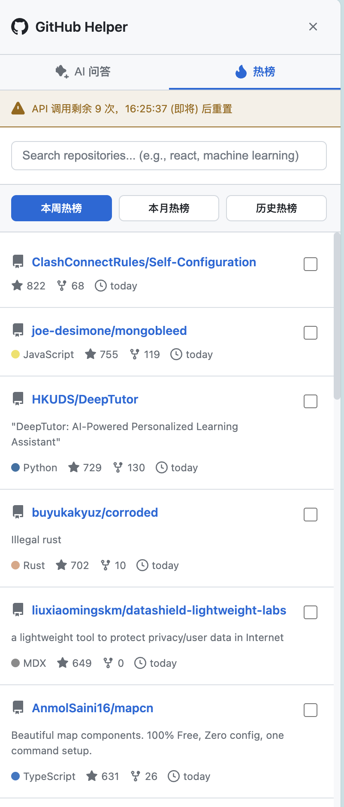
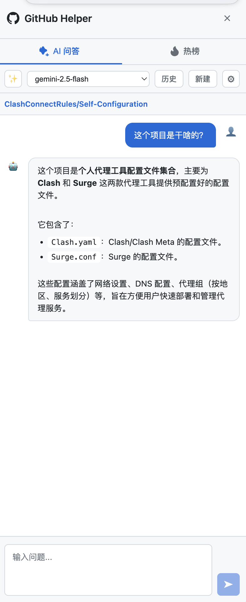

<div align="center">


# GitHub Helper

**Browser Extension - Discover Trending Repos & AI Code Assistant**

[](https://opensource.org/licenses/MIT)
[](https://github.com/mango766/githubhelper/releases/latest)
[](https://www.google.com/chrome/)
[](https://www.mozilla.org/firefox/)

[简体中文](./README.md) | English

[Quick Start](#installation) · [Features](#features) · [Usage](#usage) · [FAQ](#faq)

</div>

> [!NOTE]
> This is a third-party browser extension and is not affiliated with GitHub.

---

## Demo

<table align="center">
  <tr>
    <td align="center"><b>🔥 Trending</b><br></td>
    <td align="center"><b>🤖 AI Chat</b><br></td>
  </tr>
</table>

---

## Features

### 🔥 Trending Repository Discovery
- Browse GitHub trending repositories
- Filter by time range (daily/weekly/monthly)
- Keyword search
- Display stars, language, description

### 🤖 AI Code Assistant
- Support **Ollama** (local) and **Gemini** (cloud API)
- Auto-fetch repository context (README, file structure)
- Smart code Q&A and explanations
- Chat history persistence

### ⌨️ Shortcuts
| Shortcut | Action |
|----------|--------|
| `Ctrl+Shift+G` (Mac: `⌘+Shift+G`) | Toggle sidebar |
| `Escape` | Close sidebar |

---

## Installation

### Quick Install (Recommended)

Download from [GitHub Releases](https://github.com/mango766/githubhelper/releases/latest):

| Browser | File |
|---------|------|
| Chrome / Edge | `githubhelper-x.x.x-chrome.zip` |
| Firefox | `githubhelper-x.x.x-firefox.zip` |

### Load Extension

<details>
<summary><b>Chrome</b></summary>

1. Open `chrome://extensions/`
2. Enable "Developer mode"
3. Click "Load unpacked"
4. Select the extracted folder

</details>

<details>
<summary><b>Edge</b></summary>

1. Open `edge://extensions/`
2. Enable "Developer mode"
3. Click "Load unpacked"
4. Select the extracted folder

</details>

<details>
<summary><b>Firefox</b></summary>

1. Open `about:debugging#/runtime/this-firefox`
2. Click "Load Temporary Add-on"
3. Select `manifest.json` from the folder

</details>

### Build from Source

```bash
git clone https://github.com/mango766/githubhelper.git
cd githubhelper
npm install

# Development
npm run dev          # Chrome
npm run dev:firefox  # Firefox

# Production build
npm run build        # Chrome
npm run build:firefox

# Package zip
npm run zip
npm run zip:firefox
```

---

## Usage

1. Visit any GitHub page
2. Click the floating button or press `Ctrl+Shift+G`
3. Choose a tab:
   - **Trending**: Browse popular repositories
   - **AI Chat**: Chat with AI assistant

### Configure AI Assistant

#### Ollama (Local)
1. Install [Ollama](https://ollama.ai/)
2. Pull a model: `ollama pull llama3`
3. Configure server URL in extension settings (default: `http://localhost:11434`)

#### Gemini (Cloud)
1. Get API Key from [Google AI Studio](https://aistudio.google.com/)
2. Enter API Key and select model in settings

---

## FAQ

<details>
<summary><b>Ollama connection failed?</b></summary>

Ensure Ollama is running with CORS enabled:
```bash
OLLAMA_ORIGINS="*" ollama serve
```

</details>

<details>
<summary><b>Gemini API error?</b></summary>

- Verify API Key is correct
- Ensure network access to `generativelanguage.googleapis.com`

</details>

<details>
<summary><b>Shortcut not working?</b></summary>

- May conflict with other extensions, modify at `chrome://extensions/shortcuts`
- Ensure current page is on GitHub domain

</details>

---

## Permissions

| Permission | Purpose |
|------------|---------|
| `storage` | Save settings and chat history |
| `https://github.com/*` | Access GitHub pages |
| `https://api.github.com/*` | GitHub API calls |
| `https://generativelanguage.googleapis.com/*` | Gemini API calls |
| `http://localhost:*/*` | Connect to local Ollama |

---

## Tech Stack

[WXT](https://wxt.dev/) · [React](https://react.dev/) · [TypeScript](https://www.typescriptlang.org/)

---

## License

[MIT](./LICENSE)

⭐ Like this project? Give it a Star!
